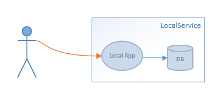
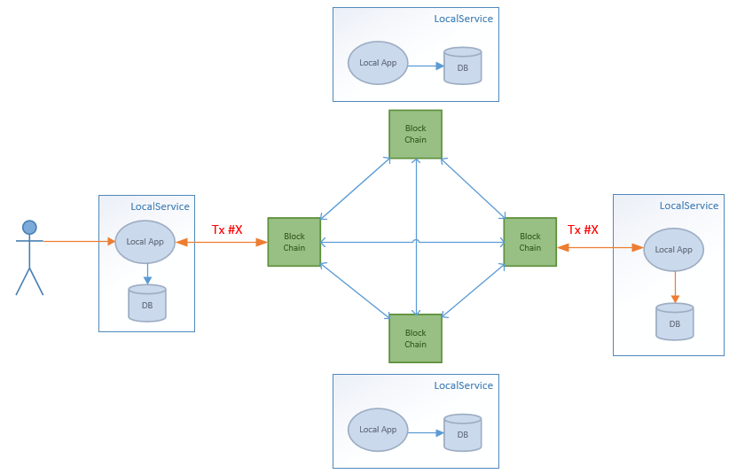

## Идея dApp сервиса

> Пока только общие идеи требующие уточнениай. До конца не понятно насколько это все
ложится в концепцию ethereum.

**Вводная:**

Существуют платежные сервисы (PS, Payment Service) принимающие платежи на собственных
клиентов, фиксируют данные в локальной БД.

 выполняющие задачи по приему и
фиксации платежей клиентов в собственной БД. Каждый клиент относятся к конкретной LS.

  

> если быть более конкретным, то это могут быть клиенты оператора связи.
Каждый абонент вносит платеж обращаясь к LS своего оператора.

Идея.
Создать dApp, которое свяжет между собой все разрозненные LS в единую приватную сеть.
Что получится.
Данные о платеже смогут поступать на вход любого узла LS.

кцукцу

LS создает
первичную транзкцию и записывает ее в чейн.
LS, которой принадлежит клиент из первичной транзакции, создает вторичную, подтверждая,
что это ее платеж, переводит на свой адрес и записывает данные о платеже на балансе килента в своей локальной БД.

Однако тут возникает много вопросов.
