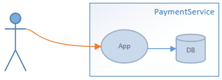
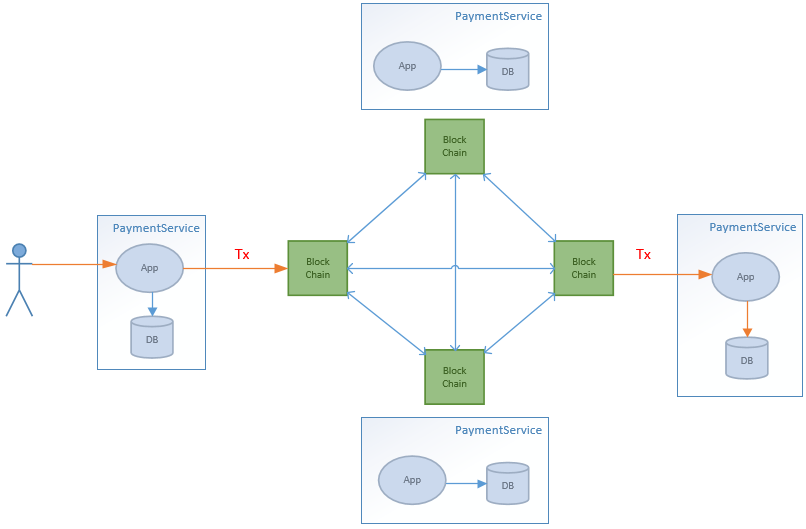

## Идея dApp сервиса

> Пока только общие идеи требующие уточнениай. До конца не понятно насколько все это ложится в концепцию ethereum.

**Вводная:**

Существуют платежные сервисы (PS, Payment Service) принимающие платежи от собственных клиентов, фиксируют данные в локальной БД.

> Можно представить, что это клиенты оператора связи. Платеж зачисляется в БД оператора к которому относится абоненты.

**Идея:**

Создать dApp (ethereum?), которое свяжет между собой все разрозненные PS в единую приватную блокчейн сеть. Решение позволит принимать платежи клиентов через любой узел PS.

**Условия**

1. Если клиент обращается к собственной PS, платеж фиксируется в локальной БД

2. Если клиент обращается к чужой PS, она создает транзакцию в блокчейне. PS которому принадлежит клиент считывает данные транзакции из блокчейн и фиксирует платеж в своей локальной БД.

**Реализация**

ываыва

LS создает
первичную транзкцию и записывает ее в чейн.
LS, которой принадлежит клиент из первичной транзакции, создает вторичную, подтверждая,
что это ее платеж, переводит на свой адрес и записывает данные о платеже на балансе килента в своей локальной БД.

Однако тут возникает много вопросов.
